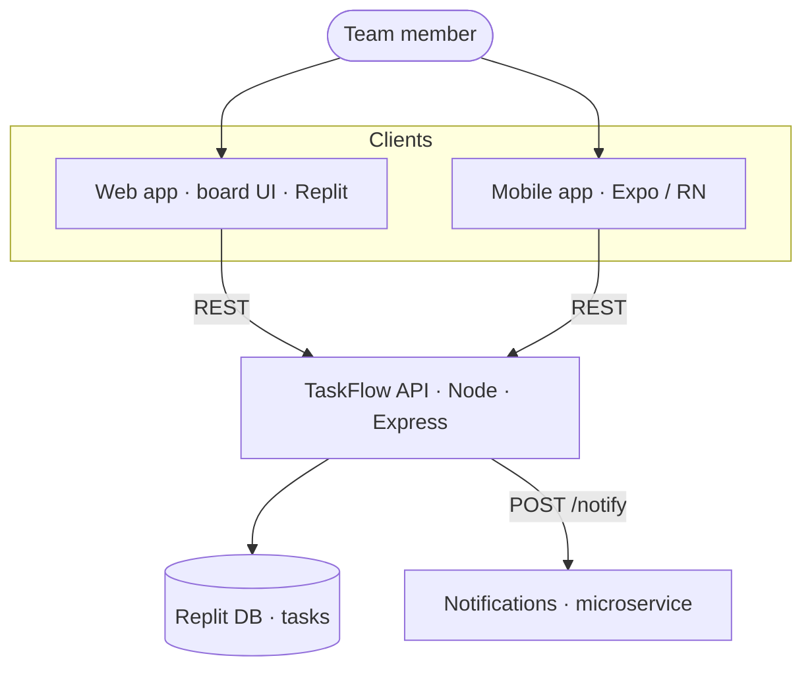

# TaskFlow — High-Level Design (HLD)
*Reference example · the architecture story, generated from the codebase*

## 1. Overview
TaskFlow is a team task-tracker delivered as three cooperating pieces: a **web app** (the board UI), a **mobile app** (Expo companion), and a **TaskFlow API** backed by **Replit DB**. A separate **notifications microservice** is called when tasks change. All clients speak to the same API, so behavior is consistent across web and mobile.

## 2. Architecture diagram
See `architecture.mmd` (Mermaid, C4 *container* view). Rendered inline:

*A formal C4 version in PlantUML is in `HLD-C4.puml`.*

## 3. Components
| Component | Responsibility | Tech |
|---|---|---|
| **Web app** | Renders the board; create/move/filter tasks | HTML/CSS/JS (Replit) |
| **Mobile app** | List + add tasks on a phone | React Native / Expo |
| **TaskFlow API** | REST endpoints, validation, business rules | Node · Express |
| **Replit DB** | Persist tasks by key `task:<id>` | Replit key-value store |
| **Notifications** | Send a notice when a task changes | Node · Express (separate service) |

## 4. Key data flows
1. **Create task** — client `POST /api/tasks` → API validates (title required) → writes `task:<id>` to Replit DB → returns the task → API fires `POST /notify`.
2. **View board** — client `GET /api/tasks?assignee=&status=` → API lists `task:` keys from DB → returns filtered set.
3. **Move task** — client `PATCH /api/tasks/:id` → API updates status in DB.

## 5. Key decisions & trade-offs
- **Replit DB over SQL** — zero setup, fits the free tier and the app's simple key-value needs; revisit if querying grows complex.
- **Notifications as a separate service** — clean boundary and independent lifecycle, at the cost of one network hop (justified: notification volume and rules differ from core CRUD).
- **Shared REST API for web + mobile** — one source of truth for behavior; the mobile app is a thin client.

## 6. Cross-cutting concerns
- **Validation** at the API boundary (never trust the client).
- **Config/secrets** via environment (`process.env.PORT`, DB is ambient in Replit).
- **Docs & diagram** regenerated from code (this file) so they don't drift.

---
*Grounded in the real repo: components, endpoints and the data model match the code built in M2–M4.*
